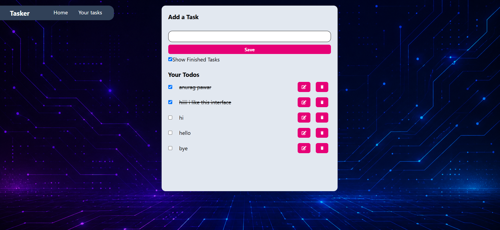

# Tasker - A Simple Todo App

Tasker is a minimal, responsive Todo List application built with React and Tailwind CSS. It lets you add, edit, complete, and delete tasks, with everything saved to your browser's local storage so your list persists across page reloads.

## Screenshot



## Features

- ➕ Add new tasks
- ✏️ Edit existing tasks
- ✅ Mark tasks as complete / incomplete
- 🗑️ Delete tasks
- 👁️ Toggle visibility of finished tasks
- 💾 Persistent storage using `localStorage` (no backend needed)
- 📱 Responsive UI styled with Tailwind CSS

## Tech Stack

- [React](https://react.dev/) - UI library
- [Vite](https://vitejs.dev/) - Build tool / dev server
- [Tailwind CSS](https://tailwindcss.com/) - Styling
- [react-icons](https://react-icons.github.io/react-icons/) - Edit/Delete icons
- [uuid](https://www.npmjs.com/package/uuid) - Unique IDs for each todo

## Getting Started

### Prerequisites

- [Node.js](https://nodejs.org/) (v16 or higher recommended)
- npm

### Installation

1. Clone the repository
   ```bash
   git clone https://github.com/your-username/tasker.git
   cd tasker
   ```

2. Install dependencies
   ```bash
   npm install
   ```

3. Start the development server
   ```bash
   npm run dev
   ```

4. Open your browser at the URL shown in the terminal (usually `http://localhost:5173`)

## Project Structure

```
src/
├── assets/
│   │── todo_bg.png
├── components/
│   └── Navbar.jsx
├── App.jsx
├── App.css
├── index.css
└── main.jsx
```

## How It Works

- Todos are stored in React state and synced to `localStorage` on every add, edit, delete, or completion toggle.
- On initial load, the app reads any saved todos from `localStorage` and populates the list.
- Editing a todo removes it from the list and loads its text back into the input field for re-saving.

## Future Improvements

- [ ] Add task categories or priorities
- [ ] Add due dates and reminders
- [ ] Drag-and-drop reordering
- [ ] Sync with a backend / database for cross-device access

## License

This project is open source and available under the [MIT License](LICENSE).
